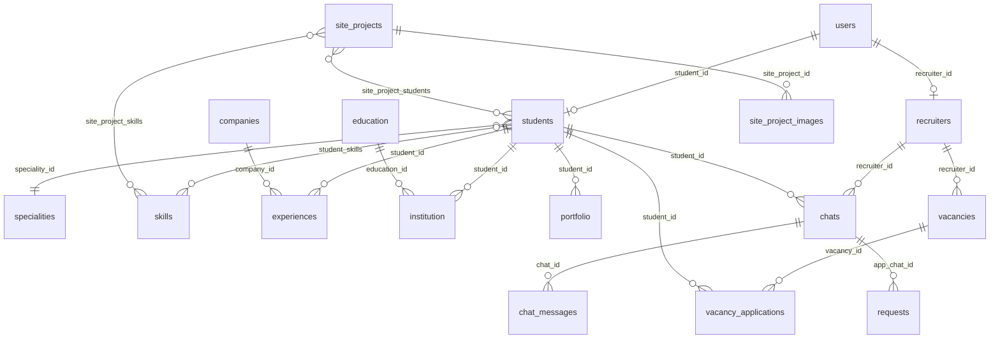

# База данных

PostgreSQL. Схему накатывает Flyway из `src/main/resources/db/migration` (сейчас до `V0057`). Hibernate только проверяет, что сущности совпадают со схемой (`ddl-auto: validate`).

Поиск по студентам использует расширение `pg_trgm` (миграция `V0021`).

Общие поля `created_at` и `updated_at` ниже названы «даты». UUID генерирует приложение, кроме таблиц с `IDENTITY` / `BIGSERIAL`.

В `users` остались неиспользуемые `first_name`, `last_name`, `email`. В `skills` остался неиспользуемый `speciality_id`.

## Связи

## Люди и аккаунты

### `users`

Учётка. Один пользователь связан максимум с одним студентом и одним рекрутером.

| Колонка | Тип | Смысл |
|---------|-----|--------|
| id | UUID PK | |
| role | VARCHAR(32) | `STUDENT`, `RECRUITER`, `ADMIN` |
| name | VARCHAR(255) | отображаемое имя |
| username | VARCHAR(64) UNIQUE | логин |
| password_hash | VARCHAR(128) | bcrypt |
| phone_verified | BOOLEAN | телефон подтверждён |
| email_verified | BOOLEAN | почта подтверждена кодом |
| email_otp_hash | VARCHAR(128) | хеш кода с почты |
| email_otp_expires_at | TIMESTAMP | срок кода |
| account_status | VARCHAR(32) | `PENDING_APPROVAL`, `APPROVED`, `REJECTED` |
| hints_disabled | BOOLEAN | подсказки в UI выключены |
| registration_phone | VARCHAR(32) | телефон с регистрации |
| registration_email | VARCHAR(255) | почта с регистрации |
| recruiter_id | UUID UNIQUE FK → recruiters | профиль рекрутера, ON DELETE SET NULL |
| student_id | UUID UNIQUE FK → students | карточка студента, ON DELETE SET NULL |

### `students`

| Колонка | Тип | Смысл |
|---------|-----|--------|
| id | UUID PK | |
| city | VARCHAR(255) | |
| hh_link | VARCHAR(255) | ссылка на HeadHunter |
| birth_date | DATE | может быть пустой у черновика |
| bio | TEXT | |
| image_path | VARCHAR(255) UNIQUE | файл аватара |
| course | VARCHAR(16) | `1` … `5` |
| busyness | VARCHAR(32) | `free`, `freelance`, `employed` |
| middle_name | VARCHAR(255) | отчество |
| gender | VARCHAR(16) | `MALE`, `FEMALE` |
| first_name, last_name | VARCHAR(255) | |
| email | VARCHAR(255) UNIQUE | почта в карточке |
| phone_number | VARCHAR(16) | |
| telegram_username | VARCHAR(32) | |
| telegram_user_id | VARCHAR(16) UNIQUE | |
| speciality_id | BIGINT FK → specialities | |
| catalog_visible | BOOLEAN | виден в каталоге рекрутера |
| public_profile_consent | BOOLEAN | согласие на публичный показ |
| profile_text_score | INTEGER | вес текста профиля для сортировки |
| manual_sort_order | INTEGER | ручной приоритет, меньше — выше |
| created_at, updated_at | TIMESTAMP | |

### `recruiters`

| Колонка | Тип | Смысл |
|---------|-----|--------|
| id | UUID PK | |
| company_name | VARCHAR(255) | |
| city | VARCHAR(255) | |
| first_name, last_name, email | VARCHAR | контактное лицо |
| phone_number | VARCHAR(16) | |
| telegram_username | VARCHAR(32) | |
| telegram_user_id | VARCHAR(16) | |
| created_at, updated_at | TIMESTAMP | |

Логин рекрутера лежит в `users`, не в этой таблице.

### `recruiter_registration_requests`

Старая очередь заявок работодателя. Текущий `POST /auth/register-recruiter` пишет сразу в `users` и `recruiters`, эту таблицу не заполняет. Админские методы для уже лежащих строк остались.

| Колонка | Тип | Смысл |
|---------|-----|--------|
| id | UUID PK | |
| username | VARCHAR(64) | |
| password_hash | VARCHAR(255) | |
| name | VARCHAR(255) | |
| company_name | VARCHAR(255) | |
| first_name, last_name, middle_name | VARCHAR | |
| email | VARCHAR(255) | |
| city | VARCHAR(255) | |
| phone_number | VARCHAR(32) | |
| telegram_username | VARCHAR(32) | |
| marketing_consent | BOOLEAN | |
| phone_verification_id | UUID | ссылка на проверку телефона |
| status | VARCHAR(32) | `PENDING`, `APPROVED`, `REJECTED` |
| reject_reason | TEXT | |
| processed_at | TIMESTAMP | |
| processed_by_username | VARCHAR(64) | |
| approved_user_id | UUID FK → users | созданный пользователь |
| created_at, updated_at | TIMESTAMP | |

Уникальный индекс на `lower(username)`, пока статус `PENDING`.

### `phone_verifications`

| Колонка | Тип | Смысл |
|---------|-----|--------|
| id | UUID PK | |
| phone_number | VARCHAR(32) | |
| email | VARCHAR(255) | если код ушёл на почту |
| otp_code_hash | VARCHAR(255) | |
| telegram_user_id | VARCHAR(32) | |
| telegram_chat_id | BIGINT | |
| status | VARCHAR(16) | `PENDING`, `CONFIRMED`, `EXPIRED` |
| created_at, confirmed_at, expires_at | TIMESTAMP | |

## Справочники и части резюме

### `companies`

`id` BIGINT identity, `name` VARCHAR(255), даты.

### `education`

Учебное заведение из справочника: `id` BIGINT, `institution`, `additional_info` TEXT, `web_url`, даты.

### `specialities`

`id` BIGINT, `name` VARCHAR(128) UNIQUE, `icon_path` VARCHAR(512), даты.

### `skills`

`id` BIGINT, `name` VARCHAR(128) UNIQUE, даты. Связь со студентом — таблица `student_skills` (`student_id`, `skill_id`, оба PK и FK, ON DELETE CASCADE).

### `experiences`

Опыт студента: `id` BIGINT, `position`, `additional_info`, `start_date`, `end_date`, `company_id` FK, `student_id` FK, даты.

### `institution`

Учёба конкретного студента: `id` BIGINT, `start_year`, `end_year`, `education_id` FK, `student_id` FK, даты.

### `portfolio`

`id` BIGINT, `name` VARCHAR(128), `link`, `additional_info`, `student_id` FK, даты.

## Заявки и чат

### `chats`

Один чат на пару рекрутер–студент (`UNIQUE (recruiter_id, student_id)`).

| Колонка | Тип |
|---------|-----|
| id | UUID PK |
| recruiter_id | UUID FK → recruiters |
| student_id | UUID FK → students |
| last_activity_at | TIMESTAMP |
| created_at, updated_at | TIMESTAMP |

### `chat_messages`

| Колонка | Тип | Смысл |
|---------|-----|--------|
| id | UUID PK | |
| chat_id | UUID FK → chats, ON DELETE CASCADE | |
| author_user_id | UUID FK → users | пусто у системных |
| message_kind | VARCHAR(16) | `user`, `system` |
| system_event | VARCHAR(64) | код события, см. [backend.md](./backend.md) |
| body | TEXT | |
| attachment_storage_name | VARCHAR(512) | имя файла на диске |
| edited_at, deleted_at | TIMESTAMP | |
| deleted_by_admin | BOOLEAN | мягкое удаление |
| created_at, updated_at | TIMESTAMP | |

### `chat_read_states`

PK `(chat_id, user_id)`. `last_read_message_id` UUID, `last_read_at` TIMESTAMP. Оба FK с ON DELETE CASCADE.

### `requests`

Заявка рекрутера студенту. `id` BIGINT identity.

| Колонка | Тип | Смысл |
|---------|-----|--------|
| result | VARCHAR(16) | см. значения ниже |
| student_response_text | TEXT | комментарий студента |
| recruiter_id | UUID FK | |
| student_id | UUID FK | |
| app_chat_id | UUID FK → chats | |
| student_tu_confirmed_at | TIMESTAMP | студент подтвердил ТУ |
| recruiter_tu_confirmed_at | TIMESTAMP | рекрутер подтвердил ТУ |
| rejection_reason_code | VARCHAR(64) | `NOT_A_FIT`, `NO_RESPONSE`, `CANDIDATE_DECLINED`, `EMPLOYER_DECLINED`, `OTHER` |
| rejection_comment | TEXT | |
| created_at, updated_at | TIMESTAMP | |

`result` в базе хранится так: `creation`, `sync`, `waiting`, `expectation`, `student_confirm`, `recruiter_conf`, `success`, `refusal`.

## Вакансии

### `vacancies`

| Колонка | Тип | Смысл |
|---------|-----|--------|
| id | UUID PK | |
| recruiter_id | UUID FK | |
| title | VARCHAR(255) | |
| description | TEXT | |
| company_name, city | VARCHAR | |
| work_format | VARCHAR(16) | `remote`, `office`, `hybrid` |
| employment_type | VARCHAR(16) | `internship`, `part_time`, `full_time`, `project` |
| speciality_id | BIGINT FK | |
| status | VARCHAR(16) | `draft`, `pending_review`, `published`, `rejected`, `closed`, `archived` |
| published_from, published_to | TIMESTAMP | окно публикации |
| slots_count | INTEGER | |
| submitted_for_review_at, moderated_at | TIMESTAMP | |
| moderated_by_username | VARCHAR(64) | |
| moderation_rejection_reason | TEXT | |
| manual_sort_order | INTEGER | |
| visible_to_anonymous | BOOLEAN | |
| created_at, updated_at | TIMESTAMP | |

Навыки: `vacancy_skills` (`vacancy_id`, `skill_id`).

### `vacancy_applications`

Один отклик студента на вакансию (`UNIQUE (vacancy_id, student_id)`).

| Колонка | Тип | Смысл |
|---------|-----|--------|
| id | UUID PK | |
| vacancy_id | UUID FK, ON DELETE CASCADE | |
| student_id | UUID FK, ON DELETE CASCADE | |
| status | VARCHAR(16) | `submitted`, `accepted`, `rejected`, `withdrawn` |
| cover_letter, recruiter_comment, rejection_reason | TEXT | |
| app_chat_id | UUID FK → chats | |
| student_tu_confirmed_at, recruiter_tu_confirmed_at | TIMESTAMP | |
| rejection_reason_code | VARCHAR(64) | те же коды, что у заявки |
| rejection_comment | TEXT | |
| created_at, updated_at | TIMESTAMP | |

## Лента проектов

### `site_projects`

| Колонка | Тип | Смысл |
|---------|-----|--------|
| id | UUID PK | |
| title | VARCHAR(255) | |
| section | VARCHAR(255) | раздел на сайте |
| summary, body | TEXT | |
| sort_order | INTEGER | |
| visible_to_anonymous | BOOLEAN | попадает на главную без входа |
| published_from, published_to | TIMESTAMP | |
| created_at, updated_at | TIMESTAMP | |

Картинки: `site_project_images` (`id` UUID, `site_project_id`, `image_path`, `image_url`, `sort_order`). Удаление проекта удаляет картинки.

Участники: `site_project_students`. Навыки: `site_project_skills`.

## Аналитика

### `analytics_events`

| Колонка | Тип | Смысл |
|---------|-----|--------|
| id | BIGSERIAL PK | |
| occurred_at | TIMESTAMP | |
| event_type | VARCHAR(64) | `PAGE_VIEW`, `REGISTRATION_STARTED`, `REGISTRATION_COMPLETED`, `ACCOUNT_APPROVED`, `APPLICATION_SUBMITTED`, `REQUEST_SUBMITTED`, `CHAT_MESSAGE_SENT`, `CHAT_TU_CONFIRMED`, `CHAT_TU_REJECTED`, `CHAT_SUCCESS` |
| path | VARCHAR(1024) | |
| session_id | UUID | |
| user_id | UUID | если пользователь известен |
| ip_hash | VARCHAR(128) | |
| user_agent | VARCHAR(512) | |
